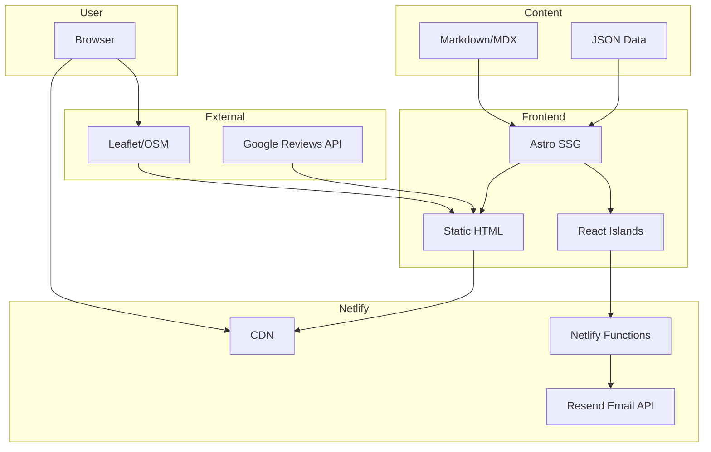

# SPECS.md — Техническая спецификация проекта Sapojnik

> Этот документ содержит формальные спецификации модулей проекта. Любое изменение кода должно ссылаться на соответствующую секцию через `spec://<модуль>/<файл>#<секция>`.

---

## 📋 Содержание

1. [Конфигурация проекта](#конфигурация-проекта)
2. [Модуль i18n](#модуль-i18n)
3. [Модуль Layout](#модуль-layout)
4. [Модуль Pages](#модуль-pages)
5. [Модуль Components](#модуль-components)
6. [Модуль Content](#модуль-content)
7. [Модуль API (Netlify Functions)](#модуль-api-netlify-functions)
8. [Модуль SEO](#модуль-seo)
9. [Модуль GDPR](#модуль-gdpr)

---

## Конфигурация проекта

### spec://config/astro — Astro Configuration

**Файл:** `astro.config.mjs`

#### Базовая конфигурация

```javascript
// @ts-check
import { defineConfig } from 'astro/config';
import tailwind from '@astrojs/tailwind';
import react from '@astrojs/react';
import mdx from '@astrojs/mdx';

export default defineConfig({
  site: 'https://sapojnik.fr',
  output: 'static',
  i18n: {
    defaultLocale: 'fr',
    locales: ['fr', 'ru'],
    routing: {
      prefixDefaultLocale: true,
    },
  },
  integrations: [
    tailwind(),
    react(),
    mdx(),
  ],
  build: {
    inlineStylesheets: 'auto',
  },
  vite: {
    build: {
      cssMinify: true,
    },
  },
});
```

#### Требования

| Параметр | Значение | Обоснование |
|----------|----------|-------------|
| `output` | `static` | SSG для максимальной производительности |
| `i18n.defaultLocale` | `fr` | Основной язык — французский |
| `i18n.routing.prefixDefaultLocale` | `true` | Явные URL для SEO |

---

### spec://config/tailwind — Tailwind Configuration

**Файл:** `tailwind.config.mjs`

#### Цветовая палитра

| Название | HEX | Использование |
|----------|-----|---------------|
| `primary` | `#8B4513` | Основной цвет (коричневый — кожа) |
| `primary-dark` | `#5D2E0C` | Hover состояния |
| `secondary` | `#D4A574` | Акцентный цвет |
| `neutral` | `#1F2937` | Текст |
| `background` | `#FAFAFA` | Фон |

#### Конфигурация

```javascript
/** @type {import('tailwindcss').Config} */
export default {
  content: ['./src/**/*.{astro,html,js,jsx,md,mdx,svelte,ts,tsx,vue}'],
  theme: {
    extend: {
      colors: {
        primary: {
          DEFAULT: '#8B4513',
          dark: '#5D2E0C',
          light: '#A0522D',
        },
        secondary: {
          DEFAULT: '#D4A574',
          dark: '#B8956A',
        },
      },
      fontFamily: {
        sans: ['Inter', 'system-ui', 'sans-serif'],
        display: ['Playfair Display', 'serif'],
      },
    },
  },
  plugins: [],
};
```

---

### spec://config/netlify — Netlify Configuration

**Файл:** `netlify.toml`

```toml
[build]
  command = "npm run build"
  publish = "dist"
  functions = "netlify/functions"

[build.environment]
  NODE_VERSION = "20"

[[redirects]]
  from = "/"
  to = "/fr/"
  status = 302
  conditions = {Language = ["fr"]}

[[redirects]]
  from = "/"
  to = "/ru/"
  status = 302
  conditions = {Language = ["ru"]}

[[redirects]]
  from = "/"
  to = "/fr/"
  status = 302

[functions]
  directory = "netlify/functions"
  node_bundler = "esbuild"
```

---

### spec://config/shell — NixOS Shell

**Файл:** `shell.nix`

```nix
{ pkgs ? import <nixpkgs> {} }:

pkgs.mkShell {
  buildInputs = with pkgs; [
    nodejs_20
    nodePackages.npm
    nodePackages.pnpm
  ];

  shellHook = ''
    echo "Sapojnik Development Environment"
    echo "Node: $(node --version)"
    echo "npm: $(npm --version)"
  '';
}
```

---

## Модуль i18n

### spec://i18n/structure — Структура переводов

**Директория:** `src/i18n/`

#### Файлы

```
src/i18n/
├── index.ts          # Экспорт и утилиты
├── fr.ts             # Французские переводы
├── ru.ts             # Русские переводы
└── types.ts          # TypeScript типы
```

#### Структура переводов

```typescript
// src/i18n/types.ts
export interface Translation {
  nav: {
    home: string;
    services: string;
    gallery: string;
    blog: string;
    contact: string;
    booking: string;
  };
  hero: {
    title: string;
    subtitle: string;
    cta: string;
  };
  services: {
    title: string;
    subtitle: string;
    items: ServiceItem[];
  };
  contact: {
    title: string;
    address: string;
    phone: string;
    email: string;
    hours: string;
  };
  footer: {
    copyright: string;
    privacy: string;
    terms: string;
  };
  forms: {
    name: string;
    email: string;
    phone: string;
    message: string;
    submit: string;
    success: string;
    error: string;
  };
}

export interface ServiceItem {
  id: string;
  title: string;
  description: string;
  price?: string;
}
```

#### Пример перевода (французский)

```typescript
// src/i18n/fr.ts
import type { Translation } from './types';

export const fr: Translation = {
  nav: {
    home: 'Accueil',
    services: 'Services',
    gallery: 'Galerie',
    blog: 'Blog',
    contact: 'Contact',
    booking: 'Rendez-vous',
  },
  hero: {
    title: 'Réparation de Chaussures à Mulhouse',
    subtitle: 'Artisan cordonnier depuis 20 ans',
    cta: 'Prendre rendez-vous',
  },
  // ... остальные переводы
};
```

---

### spec://i18n/routing — Маршрутизация

**Файл:** `src/i18n/index.ts`

#### Функции

| Функция | Описание | Возвращает |
|---------|----------|------------|
| `getLocaleFromUrl(url)` | Извлекает локаль из URL | `'fr'` \| `'ru'` |
| `useTranslations(locale)` | Возвращает функцию перевода | `(key: string) => string` |
| `getRouteFromUrl(url)` | Получает путь без локали | `string` |
| `getLocalizedUrl(path, locale)` | Добавляет локаль к пути | `string` |

#### Пример использования

```astro
---
import { useTranslations } from '../i18n';

const locale = Astro.currentLocale;
const t = useTranslations(locale);
---

<h1>{t('hero.title')}</h1>
```

---

## Модуль Layout

### spec://layout/base — BaseLayout

**Файл:** `src/layouts/BaseLayout.astro`

#### Props

| Prop | Тип | Обязательный | Описание |
|------|-----|--------------|----------|
| `title` | `string` | Да | Заголовок страницы |
| `description` | `string` | Да | Meta description |
| `locale` | `'fr'` \| `'ru'` | Да | Текущая локаль |
| `canonicalUrl` | `string` | Нет | Канонический URL |

#### Структура

```astro
---
interface Props {
  title: string;
  description: string;
  locale: 'fr' | 'ru';
  canonicalUrl?: string;
}

const { title, description, locale, canonicalUrl } = Astro.props;
---

<!DOCTYPE html>
<html lang={locale}>
  <head>
    <meta charset="UTF-8" />
    <meta name="viewport" content="width=device-width, initial-scale=1.0" />
    <title>{title} | Sapojnik</title>
    <meta name="description" content={description} />
    <link rel="canonical" href={canonicalUrl} />
    <!-- Alternate languages -->
    <link rel="alternate" hreflang="fr" href="/fr/..." />
    <link rel="alternate" hreflang="ru" href="/ru/..." />
  </head>
  <body class="bg-background text-neutral">
    <slot name="header" />
    <main>
      <slot />
    </main>
    <slot name="footer" />
  </body>
</html>
```

---

### spec://layout/header — Header Component

**Файл:** `src/components/layout/Header.astro`

#### Функциональность

1. **Логотип** — ссылка на главную
2. **Навигация** — ссылки на основные разделы
3. **Переключатель языков** — FR/RU
4. **Мобильное меню** — hamburger menu

#### Состояния

| Состояние | Поведение |
|-----------|-----------|
| Desktop (lg+) | Горизонтальное меню, языки справа |
| Mobile | Hamburger menu, выезжающее меню |

---

### spec://layout/footer — Footer Component

**Файл:** `src/components/layout/Footer.astro`

#### Секции

1. **Контакты** — адрес, телефон, email
2. **Навигация** — основные ссылки
3. **Часы работы** — расписание
4. **Социальные сети** — иконки (опционально)
5. **Правовая информация** — privacy, terms

---

## Модуль Pages

### spec://pages/home — Home Page

**Файл:** `src/pages/fr/index.astro`, `src/pages/ru/index.astro`

#### Секции страницы

1. **Hero** — заголовок, подзаголовок, CTA
2. **Services Preview** — 3-4 основные услуги
3. **Gallery Preview** — 4-6 фото работ
4. **About** — кратко о мастере
5. **Testimonials** — 2-3 отзыва
6. **Contact CTA** — призыв к действию

#### SEO

| Параметр | Значение |
|----------|----------|
| `title` | "Réparation de Chaussures à Mulhouse" |
| `description` | "Artisan cordonnier à Mulhouse. Réparation de chaussures, clef en main, sur mesure. Devis gratuit." |
| `keywords` | cordonnier, réparation chaussures, Mulhouse |

---

### spec://pages/services — Services Page

**Файл:** `src/pages/fr/services.astro`, `src/pages/ru/services.astro`

#### Структура

1. **Заголовок** — название страницы
2. **Список услуг** — карточки с описанием
3. **Цены** — примерные цены (опционально)
4. **CTA** — запись на приём

#### Данные услуг

```json
// content/services/services.json
{
  "services": [
    {
      "id": "heel-repair",
      "icon": "heel",
      "prices": {
        "from": "15€",
        "to": "40€"
      }
    }
  ]
}
```

---

### spec://pages/gallery — Gallery Page

**Файл:** `src/pages/fr/gallery.astro`, `src/pages/ru/gallery.astro`

#### Функциональность

1. **Фильтрация по тегам** — тип работы
2. **Lightbox** — просмотр фото
3. **Before/After slider** — сравнение до/после

#### Компоненты

| Компонент | Назначение |
|-----------|------------|
| `GalleryGrid` | Сетка изображений |
| `GalleryFilter` | Фильтр по тегам |
| `BeforeAfterSlider` | Слайдер сравнения |
| `Lightbox` | Полноэкранный просмотр |

---

### spec://pages/blog — Blog Pages

**Файлы:**
- `src/pages/fr/blog/index.astro` — список статей
- `src/pages/fr/blog/[slug].astro` — статья
- `src/pages/ru/blog/index.astro`
- `src/pages/ru/blog/[slug].astro`

#### Content Collection

```typescript
// src/content/config.ts
import { defineCollection, z } from 'astro:content';

const blogCollection = defineCollection({
  type: 'content',
  schema: z.object({
    title: z.string(),
    description: z.string(),
    pubDate: z.date(),
    updatedDate: z.date().optional(),
    heroImage: z.string().optional(),
    tags: z.array(z.string()).default([]),
  }),
});

export const collections = {
  blog: blogCollection,
};
```

#### Frontmatter статьи

```yaml
---
title: "Comment entretenir vos chaussures en cuir"
description: "Conseils d'entretien pour prolonger la vie de vos chaussures"
pubDate: 2024-01-15
heroImage: "/images/blog/leather-care.jpg"
tags: ["entretien", "cuir", "conseils"]
---
```

---

### spec://pages/contact — Contact Page

**Файл:** `src/pages/fr/contact.astro`, `src/pages/ru/contact.astro`

#### Компоненты

1. **Контактная информация** — адрес, телефон, email
2. **Карта** — Leaflet с маркером
3. **Часы работы** — таблица с расписанием
4. **Форма обратной связи** — Netlify Forms

---

### spec://pages/booking — Booking Page

**Файл:** `src/pages/fr/booking.astro`, `src/pages/ru/booking.astro`

#### Функциональность

1. **Форма записи** — имя, телефон, дата, время, услуга
2. **Календарь** — выбор даты (React компонент)
3. **Валидация** — клиентская + серверная

---

## Модуль Components

### spec://components/ui — UI Components

#### Button

**Файл:** `src/components/ui/Button.astro`

| Prop | Тип | По умолчанию | Описание |
|------|-----|--------------|----------|
| `variant` | `'primary'` \| `'secondary'` \| `'outline'` | `'primary'` | Вариант стиля |
| `size` | `'sm'` \| `'md'` \| `'lg'` | `'md'` | Размер |
| `href` | `string` | — | Ссылка (опционально) |
| `disabled` | `boolean` | `false` | Отключено |

#### Card

**Файл:** `src/components/ui/Card.astro`

| Prop | Тип | Описание |
|------|-----|----------|
| `title` | `string` | Заголовок |
| `description` | `string` | Описание |
| `image` | `string` | Изображение (опционально) |
| `href` | `string` | Ссылка (опционально) |

#### Input

**Файл:** `src/components/ui/Input.astro`

| Prop | Тип | Описание |
|------|-----|----------|
| `type` | `string` | Тип input |
| `name` | `string` | Имя поля |
| `label` | `string` | Label |
| `placeholder` | `string` | Placeholder |
| `required` | `boolean` | Обязательное |
| `error` | `string` | Текст ошибки |

---

### spec://components/widgets — Widget Components

#### MapWidget

**Файл:** `src/components/widgets/MapWidget.astro`

```typescript
interface Props {
  lat: number;      // 47.7494
  lng: number;      // 7.3394
  zoom?: number;    // 15
  markerText: string;
}
```

#### ContactForm

**Файл:** `src/components/widgets/ContactForm.astro`

**Использует:** Netlify Forms

```html
<form name="contact" method="POST" data-netlify="true">
  <input type="hidden" name="form-name" value="contact" />
  <!-- поля формы -->
</form>
```

#### BookingForm

**Файл:** `src/components/widgets/BookingForm.tsx` (React)

**Использует:** Netlify Functions

```typescript
interface BookingData {
  name: string;
  phone: string;
  email?: string;
  date: string;
  time: string;
  service: string;
  message?: string;
}
```

#### GallerySlider

**Файл:** `src/components/widgets/GallerySlider.tsx` (React)

**Функциональность:**
- Before/After слайдер
- Touch поддержка
- Keyboard навигация

---

## Модуль Content

### spec://content/blog — Blog Content

**Директория:** `content/blog/`

#### Структура

```
content/blog/
├── fr/
│   ├── 2024-01-15-entretien-cuir.mdx
│   ├── 2024-02-01-reparation-talon.mdx
│   └── ...
└── ru/
    ├── 2024-01-15-uhod-za-kozhey.mdx
    └── ...
```

#### Схема frontmatter

| Поле | Тип | Обязательное | Описание |
|------|-----|--------------|----------|
| `title` | `string` | Да | Заголовок |
| `description` | `string` | Да | Описание для SEO |
| `pubDate` | `Date` | Да | Дата публикации |
| `updatedDate` | `Date` | Нет | Дата обновления |
| `heroImage` | `string` | Нет | Главное изображение |
| `tags` | `string[]` | Нет | Теги |

---

### spec://content/gallery — Gallery Content

**Файл:** `content/gallery/data.json`

#### Схема

```typescript
interface GalleryItem {
  id: string;
  before: string;       // путь к фото "до"
  after: string;        // путь к фото "после"
  description: {
    fr: string;
    ru: string;
  };
  tags: string[];
  date: string;         // ISO дата
}
```

#### Пример

```json
[
  {
    "id": "heel-001",
    "before": "/images/gallery/heel-before-001.jpg",
    "after": "/images/gallery/heel-after-001.jpg",
    "description": {
      "fr": "Réparation de talon en cuir",
      "ru": "Ремонт кожаного каблука"
    },
    "tags": ["heel", "leather", "repair"],
    "date": "2024-01-15"
  }
]
```

---

### spec://content/services — Services Content

**Файл:** `content/services/services.json`

#### Схема

```typescript
interface Service {
  id: string;
  icon: string;
  description: {
    fr: string;
    ru: string;
  };
  price?: {
    from: string;
    to?: string;
  };
  duration?: string;
}
```

---

## Модуль API (Netlify Functions)

### spec://api/contact — Contact Function

**Файл:** `netlify/functions/contact.ts`

#### Endpoint

```
POST /.netlify/functions/contact
```

#### Request Body

```typescript
interface ContactRequest {
  name: string;
  email: string;
  phone?: string;
  message: string;
  locale: 'fr' | 'ru';
}
```

#### Response

```typescript
interface ContactResponse {
  success: boolean;
  message: string;
}
```

#### Логика

1. Валидация входных данных
2. Отправка email через Resend
3. Возврат подтверждения

---

### spec://api/booking — Booking Function

**Файл:** `netlify/functions/booking.ts`

#### Endpoint

```
POST /.netlify/functions/booking
```

#### Request Body

```typescript
interface BookingRequest {
  name: string;
  phone: string;
  email?: string;
  date: string;        // YYYY-MM-DD
  time: string;        // HH:MM
  service: string;
  message?: string;
  locale: 'fr' | 'ru';
}
```

#### Логика

1. Валидация даты и времени
2. Проверка на дубликаты (опционально)
3. Отправка email владельцу
4. Отправка подтверждения клиенту (опционально)

---

## Модуль SEO

### spec://seo/metadata — Meta Tags

**Файл:** `src/components/seo/MetaTags.astro`

#### Обязательные теги

```html
<!-- Primary Meta Tags -->
<title>{title} | Sapojnik</title>
<meta name="title" content={title} />
<meta name="description" content={description} />

<!-- Open Graph / Facebook -->
<meta property="og:type" content="website" />
<meta property="og:url" content={url} />
<meta property="og:title" content={title} />
<meta property="og:description" content={description} />
<meta property="og:image" content={image} />
<meta property="og:locale" content={locale} />

<!-- Twitter -->
<meta property="twitter:card" content="summary_large_image" />
<meta property="twitter:url" content={url} />
<meta property="twitter:title" content={title} />
<meta property="twitter:description" content={description} />
<meta property="twitter:image" content={image} />
```

---

### spec://seo/structured-data — Structured Data

**Файл:** `src/components/seo/StructuredData.astro`

#### LocalBusiness Schema

```json
{
  "@context": "https://schema.org",
  "@type": "ShoeRepairShop",
  "name": "Sapojnik",
  "image": "https://sapojnik.fr/images/hero/workshop.jpg",
  "address": {
    "@type": "PostalAddress",
    "streetAddress": "123 Rue de la République",
    "addressLocality": "Mulhouse",
    "postalCode": "68100",
    "addressCountry": "FR"
  },
  "geo": {
    "@type": "GeoCoordinates",
    "latitude": 47.7494,
    "longitude": 7.3394
  },
  "url": "https://sapojnik.fr",
  "telephone": "+33 3 89 XX XX XX",
  "openingHoursSpecification": [
    {
      "@type": "OpeningHoursSpecification",
      "dayOfWeek": ["Tuesday", "Wednesday", "Thursday", "Friday", "Saturday"],
      "opens": "09:00",
      "closes": "18:00"
    }
  ]
}
```

---

### spec://seo/sitemap — Sitemap

**Файл:** `src/pages/sitemap.xml.ts`

#### Генерация

```typescript
import { getCollection } from 'astro:content';

export async function GET() {
  const blogPosts = await getCollection('blog');
  
  return sitemap([
    { url: '/fr/', priority: 1.0 },
    { url: '/fr/services/', priority: 0.9 },
    { url: '/fr/gallery/', priority: 0.8 },
    { url: '/fr/blog/', priority: 0.7 },
    { url: '/fr/contact/', priority: 0.8 },
    { url: '/fr/booking/', priority: 0.8 },
    // ... русские страницы
    // ... статьи блога
  ]);
}
```

---

### spec://seo/robots — Robots.txt

**Файл:** `public/robots.txt`

```
User-agent: *
Allow: /

Sitemap: https://sapojnik.fr/sitemap.xml
```

---

## Модуль GDPR

### spec://gdpr/cookie-consent — Cookie Consent

**Файл:** `src/components/gdpr/CookieConsent.astro`

#### Требования

1. Показывать при первом посещении
2. Не загружать аналитику без согласия
3. Сохранять выбор в localStorage
4. Предоставить возможность изменить выбор

#### Категории cookies

| Категория | Описание | По умолчанию |
|-----------|----------|--------------|
| `necessary` | Технические cookies | Всегда включены |
| `analytics` | Аналитика | Требует согласия |

---

### spec://gdpr/privacy-policy — Privacy Policy Page

**Файл:** `src/pages/fr/privacy.astro`, `src/pages/ru/privacy.astro`

#### Содержание

1. Какие данные собираются
2. Как используются данные
3. Как долго хранятся
4. Права пользователя (GDPR)
5. Контакт для вопросов

---

## 📊 Диаграмма архитектуры



---

## 📝 Чек-лист перед релизом

### Performance

- [ ] Lighthouse Score > 90
- [ ] First Contentful Paint < 1.5s
- [ ] Largest Contentful Paint < 2.5s
- [ ] Cumulative Layout Shift < 0.1

### SEO

- [ ] Все страницы имеют meta tags
- [ ] Sitemap сгенерирован
- [ ] Structured data валидна
- [ ] robots.txt настроен

### Accessibility

- [ ] Все изображения имеют alt
- [ ] Контрастность текста > 4.5:1
- [ ] Клавиатурная навигация работает
- [ ] ARIA labels присутствуют

### GDPR

- [ ] Cookie consent работает
- [ ] Privacy policy опубликована
- [ ] Формы имеют согласие на обработку данных

### Mobile

- [ ] Responsive дизайн на всех страницах
- [ ] Touch-friendly элементы
- [ ] Быстрая загрузка на 3G
