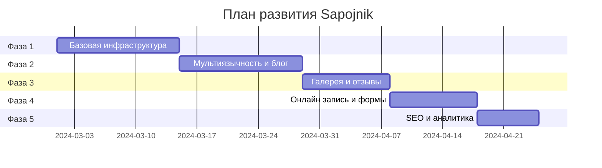
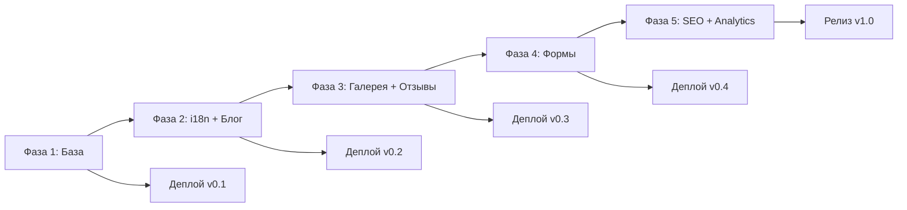

# Development Roadmap — План развития проекта Sapojnik

> Документ описывает поэтапный план разработки сайта-визитки для мастера по ремонту обуви. Каждая фаза — это законченный этап с deliverables.

---

## 📊 Обзор фаз

---

## 🚀 Фаза 1: Базовая инфраструктура и статические страницы

### Цель

Создать работающий сайт с базовыми страницами на одном языке (французский), готовый к деплою.

### Задачи

#### 1.1 Инициализация проекта

| Задача | Описание | Спецификация |
|--------|----------|--------------|
| Создать проект Astro | `npm create astro@latest sapojnik` | `spec://config/astro` |
| Настроить Tailwind CSS | Установить и сконфигурировать | `spec://config/tailwind` |
| Создать shell.nix | NixOS окружение разработки | `spec://config/shell` |
| Настроить Git | Инициализировать репозиторий, .gitignore | — |

**Deliverables:**
- [ ] Рабочий dev-сервер (`npm run dev`)
- [ ] Базовая структура директорий
- [ ] Git репозиторий с первым коммитом

#### 1.2 Базовый Layout

| Задача | Описание | Спецификация |
|--------|----------|--------------|
| Создать BaseLayout | Общий шаблон страниц | `spec://layout/base` |
| Создать Header | Навигация, логотип | `spec://layout/header` |
| Создать Footer | Контакты, ссылки | `spec://layout/footer` |

**Deliverables:**
- [ ] `src/layouts/BaseLayout.astro`
- [ ] `src/components/layout/Header.astro`
- [ ] `src/components/layout/Footer.astro`

#### 1.3 UI Компоненты

| Задача | Описание | Спецификация |
|--------|----------|--------------|
| Button | Кнопка с вариантами | `spec://components/ui` |
| Card | Карточка контента | `spec://components/ui` |
| Input | Поля ввода | `spec://components/ui` |

**Deliverables:**
- [ ] `src/components/ui/Button.astro`
- [ ] `src/components/ui/Card.astro`
- [ ] `src/components/ui/Input.astro`

#### 1.4 Статические страницы (FR)

| Страница | Файл | Спецификация |
|----------|------|--------------|
| Главная | `src/pages/index.astro` | `spec://pages/home` |
| Услуги | `src/pages/services.astro` | `spec://pages/services` |
| Контакты | `src/pages/contact.astro` | `spec://pages/contact` |

**Deliverables:**
- [ ] Главная страница с Hero секцией
- [ ] Страница услуг с карточками
- [ ] Страница контактов с картой (Leaflet)

#### 1.5 Деплой

| Задача | Описание |
|--------|----------|
| Создать netlify.toml | Конфигурация Netlify |
| Подключить Git к Netlify | Автоматический деплой |
| Настроить домен | sapojnik.fr (или тестовый) |

**Deliverables:**
- [ ] Работающий сайт на Netlify
- [ ] HTTPS настроен
- [ ] Автоматический деплой из main

### Критерии завершения Фазы 1

- [ ] Сайт доступен по URL
- [ ] Все базовые страницы открываются
- [ ] Навигация работает
- [ ] Карта отображается
- [ ] Mobile-friendly (базовая адаптация)

---

## 🌍 Фаза 2: Мультиязычность и блог

### Цель

Добавить поддержку русского языка и функционал блога.

### Задачи

#### 2.1 i18n Инфраструктура

| Задача | Описание | Спецификация |
|--------|----------|--------------|
| Создать структуру i18n | Директория и типы | `spec://i18n/structure` |
| Создать переводы FR | Французские тексты | `spec://i18n/structure` |
| Создать переводы RU | Русские тексты | `spec://i18n/structure` |
| Настроить роутинг | Перенаправления по языку | `spec://i18n/routing` |

**Deliverables:**
- [ ] `src/i18n/index.ts`
- [ ] `src/i18n/fr.ts`
- [ ] `src/i18n/ru.ts`
- [ ] `src/i18n/types.ts`

#### 2.2 Мультиязычные страницы

| Задача | Описание |
|--------|----------|
| Реструктурировать страницы | Переместить в `pages/fr/` и `pages/ru/` |
| Добавить переключатель языков | В Header |
| Настроить alternate links | Для SEO |

**Deliverables:**
- [ ] Страницы на французском (`/fr/*`)
- [ ] Страницы на русском (`/ru/*`)
- [ ] Автоматический редирект по Accept-Language
- [ ] Переключатель языков в шапке

#### 2.3 Блог — Content Collections

| Задача | Описание | Спецификация |
|--------|----------|--------------|
| Настроить Content Collections | Схема блога | `spec://content/blog` |
| Создать директорию контента | `content/blog/fr/`, `content/blog/ru/` | — |
| Добавить тестовые статьи | 2-3 статьи на каждом языке | — |

**Deliverables:**
- [ ] `src/content/config.ts`
- [ ] `content/blog/fr/*.mdx`
- [ ] `content/blog/ru/*.mdx`

#### 2.4 Страницы блога

| Страница | Файл | Спецификация |
|----------|------|--------------|
| Список статей | `src/pages/[locale]/blog/index.astro` | `spec://pages/blog` |
| Статья | `src/pages/[locale]/blog/[slug].astro` | `spec://pages/blog` |

**Deliverables:**
- [ ] Страница со списком статей
- [ ] Страницы отдельных статей
- [ ] Пагинация (если нужно)

### Критерии завершения Фазы 2

- [ ] Сайт доступен на двух языках
- [ ] Переключение языков работает
- [ ] Блог отображает статьи
- [ ] Статьи доступны на обоих языках

---

## 🖼️ Фаза 3: Галерея и отзывы

### Цель

Добавить визуальный контент — галерею работ и отзывы клиентов.

### Задачи

#### 3.1 Галерея — данные

| Задача | Описание | Спецификация |
|--------|----------|--------------|
| Создать структуру данных | JSON с метаданными | `spec://content/gallery` |
| Подготовить изображения | Оптимизация, WebP | — |
| Загрузить тестовые фото | 10-15 работ | — |

**Deliverables:**
- [ ] `content/gallery/data.json`
- [ ] `public/images/gallery/*.jpg`

#### 3.2 Компоненты галереи

| Компонент | Описание | Спецификация |
|-----------|----------|--------------|
| GalleryGrid | Сетка изображений | `spec://components/widgets` |
| GalleryFilter | Фильтр по тегам | `spec://components/widgets` |
| BeforeAfterSlider | Слайдер до/после | `spec://components/widgets` |
| Lightbox | Полноэкранный просмотр | `spec://components/widgets` |

**Deliverables:**
- [ ] `src/components/widgets/GalleryGrid.astro`
- [ ] `src/components/widgets/GalleryFilter.astro`
- [ ] `src/components/widgets/BeforeAfterSlider.tsx` (React)
- [ ] `src/components/widgets/Lightbox.tsx` (React)

#### 3.3 Страница галереи

| Задача | Описание |
|--------|----------|
| Создать страницу галереи | FR и RU версии |
| Интегрировать компоненты | Grid, Filter, Lightbox |

**Deliverables:**
- [ ] `src/pages/fr/gallery.astro`
- [ ] `src/pages/ru/gallery.astro`

#### 3.4 Отзывы

| Задача | Описание |
|--------|----------|
| Создать структуру данных | JSON с отзывами |
| Создать компонент Testimonials | Карточки отзывов |
| Добавить на главную | Секция с отзывами |

**Deliverables:**
- [ ] `content/testimonials/data.json`
- [ ] `src/components/widgets/Testimonials.astro`
- [ ] Секция отзывов на главной

### Критерии завершения Фазы 3

- [ ] Галерея отображает работы
- [ ] Фильтрация по тегам работает
- [ ] Before/After слайдер функционален
- [ ] Lightbox открывает фото
- [ ] Отзывы отображаются на главной

---

## 📝 Фаза 4: Онлайн запись и формы

### Цель

Реализовать интерактивные формы — обратная связь и онлайн запись.

### Задачи

#### 4.1 Форма обратной связи

| Задача | Описание | Спецификация |
|--------|----------|--------------|
| Создать ContactForm | Netlify Forms | `spec://components/widgets` |
| Добавить на страницу контактов | Интеграция | `spec://pages/contact` |
| Настроить уведомления | Email владельцу | — |

**Deliverables:**
- [ ] `src/components/widgets/ContactForm.astro`
- [ ] Форма работает через Netlify Forms
- [ ] Email уведомления приходят

#### 4.2 Netlify Functions

| Задача | Описание | Спецификация |
|--------|----------|--------------|
| Настроить Functions | Директория, конфиг | `spec://config/netlify` |
| Создать contact function | Обработка формы | `spec://api/contact` |
| Интегрировать Resend | Email API | — |

**Deliverables:**
- [ ] `netlify/functions/contact.ts`
- [ ] Переменные окружения настроены
- [ ] Email отправляется через Resend

#### 4.3 Форма онлайн записи

| Задача | Описание | Спецификация |
|--------|----------|--------------|
| Создать BookingForm | React компонент | `spec://components/widgets` |
| Добавить календарь | Выбор даты | — |
| Создать booking function | Обработка записи | `spec://api/booking` |

**Deliverables:**
- [ ] `src/components/widgets/BookingForm.tsx`
- [ ] `netlify/functions/booking.ts`
- [ ] `src/pages/fr/booking.astro`
- [ ] `src/pages/ru/booking.astro`

#### 4.4 Валидация форм

| Задача | Описание |
|--------|----------|
| Клиентская валидация | HTML5 + JS |
| Серверная валидация | В Functions |
| Сообщения об ошибках | i18n сообщения |

**Deliverables:**
- [ ] Валидация на клиенте
- [ ] Валидация на сервере
- [ ] Сообщения на обоих языках

### Критерии завершения Фазы 4

- [ ] Форма обратной связи отправляется
- [ ] Email приходит владельцу
- [ ] Форма записи работает
- [ ] Валидация работает корректно
- [ ] Сообщения об ошибках понятны

---

## 🔍 Фаза 5: SEO-оптимизация и аналитика

### Цель

Оптимизировать сайт для поисковых систем и добавить аналитику.

### Задачи

#### 5.1 Meta Tags

| Задача | Описание | Спецификация |
|--------|----------|--------------|
| Создать MetaTags компонент | Все meta теги | `spec://seo/metadata` |
| Интегрировать во все страницы | В BaseLayout | — |
| Добавить Open Graph | Для соцсетей | `spec://seo/metadata` |

**Deliverables:**
- [ ] `src/components/seo/MetaTags.astro`
- [ ] Уникальные title/description на всех страницах
- [ ] Open Graph теги

#### 5.2 Structured Data

| Задача | Описание | Спецификация |
|--------|----------|--------------|
| Создать StructuredData компонент | JSON-LD | `spec://seo/structured-data` |
| LocalBusiness schema | Данные бизнеса | `spec://seo/structured-data` |

**Deliverables:**
- [ ] `src/components/seo/StructuredData.astro`
- [ ] Валидная разметка Schema.org

#### 5.3 Sitemap и Robots

| Задача | Описание | Спецификация |
|--------|----------|--------------|
| Создать sitemap.xml | Автогенерация | `spec://seo/sitemap` |
| Создать robots.txt | Правила индексации | `spec://seo/robots` |

**Deliverables:**
- [ ] `src/pages/sitemap.xml.ts`
- [ ] `public/robots.txt`

#### 5.4 GDPR Compliance

| Задача | Описание | Спецификация |
|--------|----------|--------------|
| Cookie Consent баннер | Согласие на cookies | `spec://gdpr/cookie-consent` |
| Privacy Policy страница | Политика конфиденциальности | `spec://gdpr/privacy-policy` |

**Deliverables:**
- [ ] `src/components/gdpr/CookieConsent.astro`
- [ ] `src/pages/fr/privacy.astro`
- [ ] `src/pages/ru/privacy.astro`

#### 5.5 Аналитика

| Задача | Описание |
|--------|----------|
| Выбрать analytics | Plausible или Fathom |
| Интегрировать | После согласия cookies |
| Настроить цели | Формы, клики |

**Deliverables:**
- [ ] Аналитика подключена
- [ ] Отслеживание конверсий

#### 5.6 Performance Optimization

| Задача | Описание |
|--------|----------|
| Оптимизация изображений | WebP, lazy loading |
| Minification | CSS, JS |
| Критический CSS | Above the fold |

**Deliverables:**
- [ ] Lighthouse Score > 90
- [ ] Core Web Vitals в зелёной зоне

### Критерии завершения Фазы 5

- [ ] Все страницы имеют корректные meta tags
- [ ] Structured data валидна
- [ ] Sitemap сгенерирован
- [ ] Cookie consent работает
- [ ] Privacy policy опубликована
- [ ] Аналитика работает
- [ ] Lighthouse Score > 90

---

## 📋 Итоговый чек-лист

### Перед запуском

| Категория | Проверка | Статус |
|-----------|----------|--------|
| **Content** | Все тексты на месте (FR/RU) | [ ] |
| **Content** | Изображения оптимизированы | [ ] |
| **Functionality** | Все формы работают | [ ] |
| **Functionality** | Карта отображается | [ ] |
| **SEO** | Meta tags на всех страницах | [ ] |
| **SEO** | Sitemap и robots.txt | [ ] |
| **SEO** | Structured data валидна | [ ] |
| **Performance** | Lighthouse > 90 | [ ] |
| **Performance** | Core Web Vitals OK | [ ] |
| **Accessibility** | Alt теги на изображениях | [ ] |
| **Accessibility** | Контрастность текста | [ ] |
| **GDPR** | Cookie consent | [ ] |
| **GDPR** | Privacy policy | [ ] |
| **Mobile** | Responsive на всех страницах | [ ] |
| **Mobile** | Touch-friendly элементы | [ ] |

---

## 🔄 Поддержка после запуска

### Регулярные задачи

| Задача | Частота |
|--------|---------|
| Добавление статей блога | По необходимости |
| Обновление галереи | По необходимости |
| Модерация отзывов | По необходимости |
| Проверка аналитики | Еженедельно |
| Обновление зависимостей | Ежемесячно |
| Бэкап контента | Еженедельно |

### Добавление контента владельцем

#### Новая статья блога

1. Создать файл `content/blog/fr/YYYY-MM-DD-slug.mdx`
2. Добавить frontmatter с метаданными
3. Написать контент в Markdown
4. Создать перевод в `content/blog/ru/`
5. Git commit и push
6. Netlify автоматически задеплоит

#### Новое фото в галерею

1. Добавить изображения в `public/images/gallery/`
2. Обновить `content/gallery/data.json`
3. Git commit и push

---

## 📊 Диаграмма зависимостей фаз

---

## 🎯 Риски и митигация

| Риск | Вероятность | Влияние | Митигация |
|------|-------------|---------|-----------|
| Нет контента от владельца | Средняя | Высокое | Подготовить placeholder-контент |
| Проблемы с Resend API | Низкая | Среднее | Резервный вариант — EmailJS |
| Превышение лимитов Netlify | Низкая | Среднее | Мониторинг, при необходимости — миграция |
| Проблемы с i18n роутингом | Средняя | Низкое | Тестирование на ранних этапах |

---

## 📝 Примечания

1. **Итеративный подход** — каждая фаза заканчивается работающим сайтом
2. **Приоритет контента** — владелец должен предоставить тексты и фото
3. **Mobile-first** — все изменения тестируются на мобильных устройствах
4. **GDPR** — соответствие европейскому законодательству обязательно
5. **Простота поддержки** — владелец должен уметь добавлять контент без разработчика
